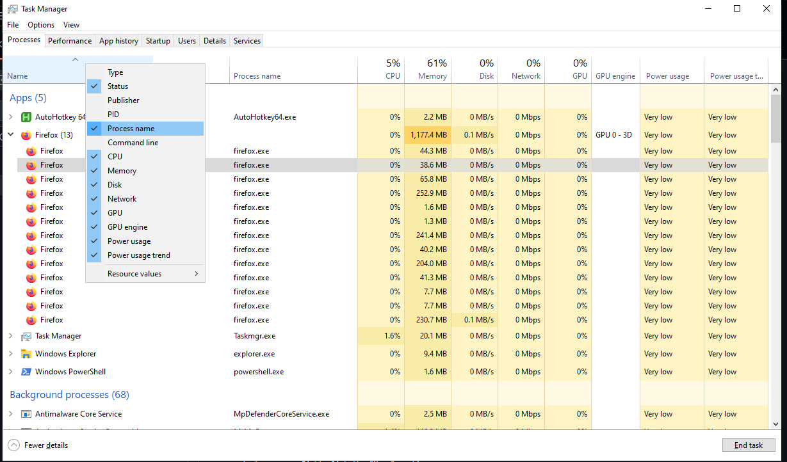

# AutoSendKey
**Warning! This is a fully AI generated script. Use at your own risk!**
I do not claim ownership of this media. Please try to check or evaluate the script for yourself before executing.
Even tho I have checked for myself, it may contain errors I did not encounter or big big "oh no".
*I also wouldn't mind if any of you told me of an alternative, it would be much appreciated

This is an Auto Hotkey script, I use it to automate keyboard input on apps or games. It works but there's a few problem
I've found myself
You are going to be expecting to see something like this

It's not a resizable window and the text below will be cut off.

# Usage & Instruction
First, you'll need to install [AutoHotkey](https://www.autohotkey.com/), and download the V2
Second, go over to release, and download the .AHK file
Third, obviously run the script.

Does the buttons looks confusing? I agree, it does. Anyway
To make an input and automate it, for example, the Space key, put in "{Space}", customize the interval(delay between inputs) or/and Duration(optional, makes it stop after for example, 100ms and click 'Add input', it will appear on the 'Automation Inputs' table and you should click on it, after it turns blue(selected), press 'Update Selected'
Remove selected and Clear all inputs says what it does, however, it does not clear the 'Run only when active process matches' box.
To make it only work when a specific process is 'focused on', modify the 'Run only when active process matches' tab and put the Process name you want it to work on, to get a program or games Process name, you can press 'CTRL + SHIFT + ESC' to open task manager. Right click the "Name" section

